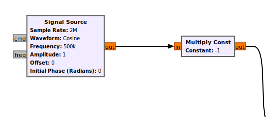

Ok so I couldn't actually submit this thing on time but I later realized there was just one fking thing I had to do and that too due to the bs stuff done by our beloved TAs of EE340. Fk u hard TAs srsly.

Due to this one fking mistake by these self glorified people I now have to do the project. Anyway I am interested to do that but still Fk U hard EE340.

All I had to do at that point was to add this multiply const block to take negative of the signal. Because these ignorant gnats maybe fked up while making the input sigal. How tf can someone do such a mistake?

